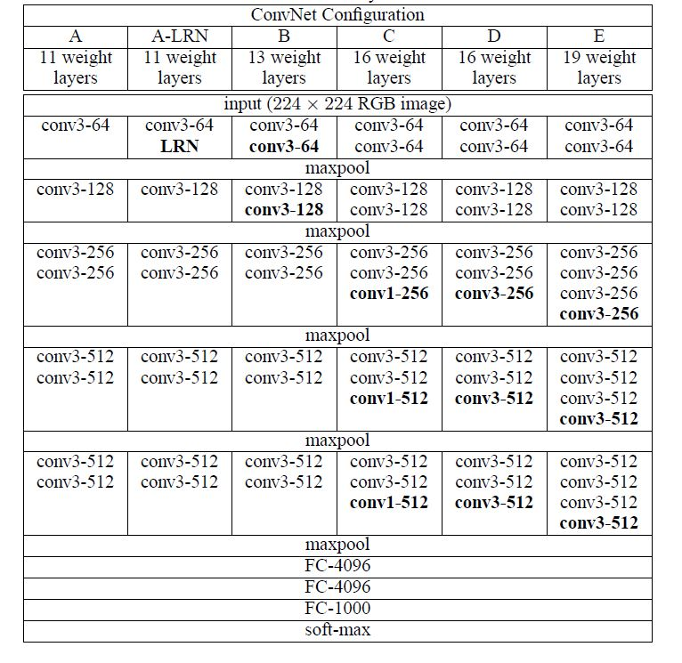

## "VERY DEEP CONVOLUTIONAL NETWORKS FOR LARGE-SCALE IMAGE RECOGNITION"

<!--使用MathJax编辑latex公式-->

### 使用\\(3*3\\)卷积核，在使用较多参数的前提下，增加了识别的准确率，并首次将神经网络的层数增加到16-19层。

---

## 1.前言
---
- 我们建立了一种准确性更高的神经网络，这种网络不仅自身具有良好的图像识别功能，也可以作为别的系统中的预处理部分，比如为线性支持向量机提供卷积特，本文减少了两种我们效果较好的网络VGG-16与VGG-19。（As a result, we come up with significantly more accurate ConvNet architectures, which not only achieve the state-of-the-art accuracy on ILSVRC classification and localization tasks, but are also applicable to other image recognition datasets, where they achieve excellent performance even when used as a part of a relatively simple pipelines. We have released our two best-performing models to facilitate further research.)

-  VGG网络第一次将神经网络的结构递推到16-19层，使用了更小的卷积核和更小的步长进行卷积计算，导致了网络具有较多的参数，但是识别的效果较为准确，在后续的RCNN、FRCNN、YOLO、SSD系列的物体定位识别网络中，都较多地使用了VGG进行特征提取。

## 2. 网络结构
---
- 整体VGG的网络结构与参数如下图所示： 

- 本文中使用了一系列的\\(1\times1\\)的卷积，该卷积核的物理意义就是进行一种线性映射，在论文《Network in Network》中已经正式了该卷积核的效果。(The incorporation of \\(1\times1\\) conv layers. is a way to increase the non-linearity of the decision function without affecting the receptive fileds of the conv layers. Even though in our case the \\(1\times1\\)convolution is essentially a linear projection onto the space of the same dimensionality, and additional non-linearity is introduced by the rectification function. It should be noted that \\(1\times1\\) conv layers have recently been utilised in "Network in Network" architetcture.)

- Snall size convolution filters have been previously used by Ciresan et al, but their nets are significantly less deep than ours, and they did not evaluate on the large-scale ILSVRC dataset. Goodfellow applied deep ConvNets to the task of street number recognition, and showed that the inreased depth led to better preformance.GooglLeNet，a top-performing network, which topology is more complex than ours, and the spatial resolution of the feature maps is reduced more aggressively in the first layers to decrease the amount of computation. Mix network mayby show better perfomance?

## 3. 构造核函数
---

## 4. 基于高斯过程的回归

- 
- 

