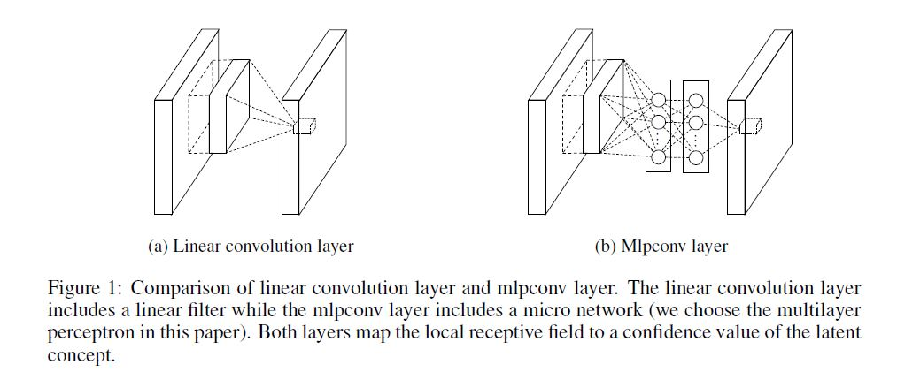

## "Network In Network"

<!--使用MathJax编辑latex公式-->

### 首次尝试使用\\(1\times1)\\滤波核进行卷积工作

---

## 1.前言
---
- 我们将介绍一种名叫“Network In Network”的神经网络，这种网络可以增强系统中局部感受野的分辨能力。We propose a novel deep network structure called "Network in Network" to enhance model discriminability for local patches within the receptive field. The conventional convolutional layer uses linear filters followed by a nonlinear activation function to scan the input.

- 我们将举例说明使用多层感知机加微小网络可以构成一个函数拟合器，我们使用微小网络在特征图上进行滑窗，通过堆叠这种小网络，就可以实现“Network In Network”，使用这种框架实现的网络比较不容易发生过拟合现象，我们在CIFAR-10以及CIFAR-100数据集上测试了该网络，并取得了不错的效果。 
We instantiate the micro neural network with a multilayer perceptron, which is a potent function approximator. The feature maps are obtained by sliding the micro networks over the input in a similar manner as CNN;they are then fed into the next layer. Deep NIN can be implemented by stacking mutiple of the above descirbed structure. With ecnhanced local modeling via the micro network, we are able to utilize global avrage pooling over feature maps in the classification layer.  

- The convolution filter in CNN is a generalized linear model for the underlying data patch, and we aregue tahta the level of abstraction is low with GLM. By abstraction we mean that the feature is invairnat to the variants of the same concept. Replacing the GLM with a more potent nonlinear function approximator can enhanve the abstraction ability of the local model. GLM can achieve a good extent of abstraction when the samples of the latent concepts area linearly separable, the variants of the concepts all live on one side of of the sparation plane defined by the GLM. 

- In NIN,the GLM is replaced with a "micor network strucature which is a general nonlinear function approximator.

- mlpconv层与CNN之间的差异如下面所示：

## 2. 网络结构
---
- Using the linear rectifier as an example, the feature map can be calculated as follows:
