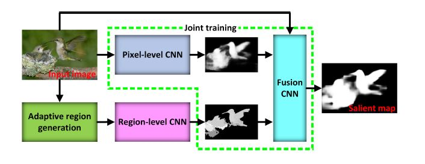
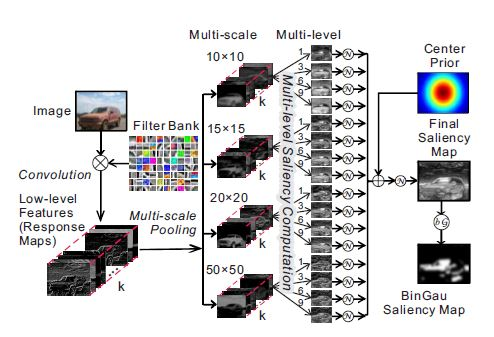
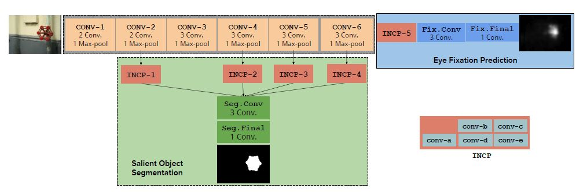
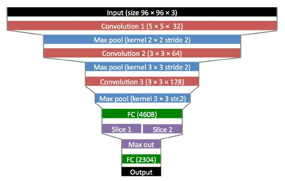
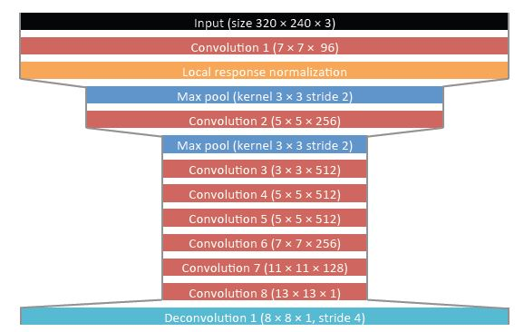
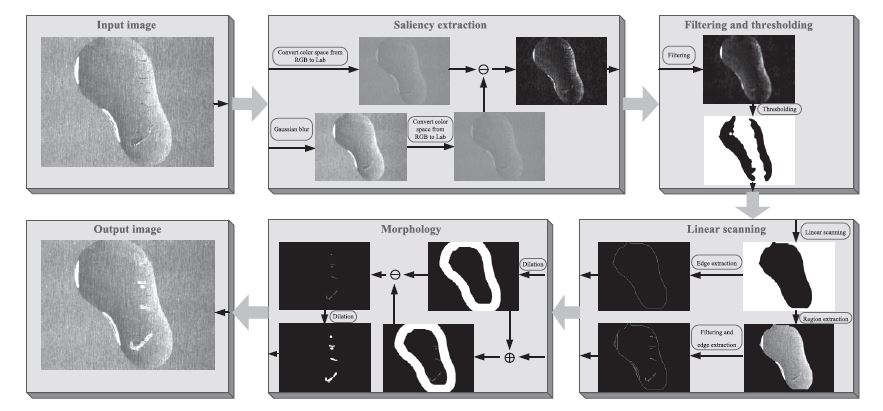

# 基于CNN显著特征检测及缺陷检测方法论文总结

---
## 1."Saliency Detcction via Combining Region-Level and Pixel-Level Predictions with CNNs"
---

### 论文主要贡献：
---
- 本算法主要包括两个方法，第一是***区域显著性估计（region-level saliency estimation）***，第二是***边缘显著性预测(pixel-level saliency prediction)***。
- 针对像素显著性预测，文章使用了基于VGG模型的pixel-level CNN进行多尺度特征学习。
- 针对区域显著性估计任务，使用超像素区域生成技术将图片分割成区域，随后使用CNN model进行区域边缘估计。
- 针对区域显著性估计网络和边缘显著性预测网络的结果，使用融合网络将两者的输出生成最后的显著性检测结果

本文建立了三个网络进行显著性提取

### 论文思考
- 论文提出一种叫CRPSD的多层CNN的目标显著性检测框架，其中pixel-level CNN用来采集图像的多尺度特征，region-level CNN与自适应区域生成技术相结合，用来估计区域的显著性，fusion CNN根据原图、pixel-level CNN、region-level CNN的结果进行最终的目标显著性检测
- ***从论文给出的最终效果看，其指标较第二第三名有较大提升，但使用多个网络进行目标显著性提取存在一定训练成本，但是由于神经网络具有较强的泛化能力，可以尝试训练一个效果较好的网络后进行finetune***
- ***论文使用的网络模型为VGG-NET，如果将其替换为RES-NET，从性能上应该会有一定提升***

---
## 2."Saliency Detection within a Deep Convolutional Architecture"
---

### 论文主要贡献：
---
- 本文首先使用了k-means外加卷积提取图像低级特征，在低级特征的基础上使用条件阈值与池化技术生成图像的中级特征。 
- 根据生成的中级特征，使用一系列hand-craft滤波器计算图像在多种尺度、多种级别下的对比度，根据这些对比度建立了图像的中间边缘信息，最终将这些边缘信息与图像进行融合
- 本方法的优势在于不仅抓住了物体的材质特性，同时探索了所有的显著目标物体（also discovers the overall salient object in the image）

### 论文思考
- 论文沿用了传统视觉检测方法中的提特征+识别两步分离的想法，通过使用卷积和多种滤波器分别提取所谓不同级别特征的方法进行目标显著性识别
- ***值得思考的一点是当前主流的思想是CNN提取的底层和中层特征已经能较好地描述一副图像中的信息了，作者加入的所谓Filter bank是真的能显著提升算法的识别能力还是仅仅为了创新而强行加进去的有待验证***

---
## 3."Saliency Unified: A Deep Architecture for simultaneous Eye Fixation Prediction and Salinet Object Segmentation"
---

### 论文主要贡献：
---
- 本文提出了一种在基于统一框架的眼注视预测与显著物体分割的神经网络识别方法we propose a deep convolutional neural network cpable of predicting eye fixations and sementing salient objects in a unified framework
- 我们设计的初始化网络，可以适用于多种任务，在每个任务中，被用来进行提取物体边缘以及全局边缘上下文关系we design the initial network layers, shared between both the tasks, such that they capture the object level semantics and the global contextual aspects of saliency

**显著性目标分割与注意力预测的网络结构图**

---
### 论文思考：
---
- 本文提出的网络通过使用较大局部感受野(较大滤波核)和Inception模块，能较好地捕捉图像分割的低级与高级特征
- ***论文在沿用了VGG-NET的框架上加入了一些自己的思考，比如有意识地加入较大核的卷积以及Incption模块来获得一些全局的上下文信息，当前的Incption模块已经更新到v4，理论上来说将新版本的Incption加入这个框架也会继续带来效果的提升，可以尝试*** 

---
##  4."Shallow and Deep Convolutional Networks for Saliency Prediction"
---

### 论文主要贡献：
---
- 本文将针对显著目标进行识别的过程转化为显著性目标真值与估计值的欧式距离损失函数最小的优化过程，并使用神经网络对该损失函数进行训练，将**显著性问题转化为回归问题进行解决**
- **本文训练两个网络，shallow网络为分类网络，deep网络将shallow训练好的前三层进行复用进行回归计算**

**shallow网络**

**deep网络**

---
### 2.论文结论：
- 本文通过训练两个神经网络的方法建立了一种端到端的显著目标识别系统
- ***深层网络具有更好的检测效果，而浅层网络较易训练，根据结果看深层网络对于结果的提升不是决定性的，而且作者既然想做成回归，为什么不建立一个深层的分类网络然后将最后的softmax层拆掉，就变成一个较好的回归模型了，论文的方法感觉还是分层训练最终叠加，这在目前的主流分类任务中被证明效果并不好***
---

---
##  5."Surface Defect Detection Method Using Saliency Linear Scanning Morphologt For Silicon Steel Strip Under Oil Pollution Interference"
---

### 论文主要贡献：
---
- 基于显著性线性扫描方法的表面缺陷检测, 基于显著性特征提取的方法可以同时抑制杂乱的背景并定位潜在的目标物体，随后使用线性扫描的方法来获取油污污染区域，最后使用形态学处理去除油污区域并进行反向验证

基于显著特征提取、滤波、线性扫描、形态学的缺陷检测系统

---
### 论文结论:
- 本文为了解决复杂背景问题，提出了一种使用使用目标显著性进行定位然后使用开闭操作进行滤波，根据滤波结果使用全局阈值进行二值化，针对二值化图像使用线性扫描得到油污区域，针对油污区域，使用了传统的图像学方法进行缺陷精细查找
- ***作者自己也在论文中说明了，这是为了解决目标问题的定制的算法，不过这种方法应该是目前我们组解决缺陷问题的主要途径，可以尝试将CNN主要用来进行定位和预处理，然后再使用稳定的机器视觉算法进行缺陷检测***
