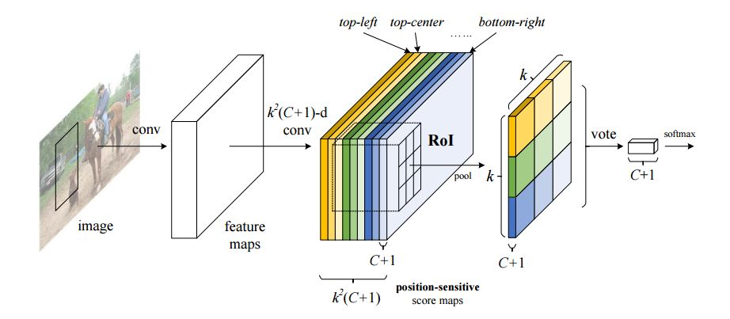

# "Fully Convolutional Networks for Semantic Segmentation"

<!--使用MathJax编辑latex公式-->

## 摘要
---
本文使用深度分类网络和迁移学习,迁移学习在多种识别任务中已经被证实了其有效性.
- 全卷积神经网络已经被广泛应用于滑窗识别,分割,姿态估计中.
- 我们抛却了传统的分割方法, 改用, we do study patchwise training from the perspective of FCNs.we adapt and extend deep classification architectures,using image classification as supervised pre-training, and fine-tune fully convolutionally to learn simply and efficiently from whole image inputs and whole image ground hruths
---
## 论文的主要贡献：
---
- 全卷积神经网络: locations in higher layers correspond to the locations in the image they are path-connected to, which are called their receptive fields, 卷积神经网络是建立在旋转不变性的基础上的, 它的主要构成部分是卷积\池化\激活函数,$$y_(ij)=f_(ks)({X_(si)+})$$

- 在R-FCN中，所有的层都是卷积层，最后一层卷积层生成\\k^2\\个位置敏感得分图，并得到\\k^2(C+1)\\个输出层

- R-FCN最终层未位置敏感ROI聚合层，该层将最后的卷积层和生成得分聚合在一起，我们的位置感敏ROI聚合层将会对最终的卷积层进行锐化。

- Backbone architecture: R-FCN是基于ResNet-101模型的，原始的ResNet-101模型包含100个卷积层与全局均值池化层，并进行一千分类任务，我们将均值池化层与全连接层去掉，仅保留卷积层，然后我们在最底层加上1024d \\(1\*1\\)的卷积层进行降维，

- Position-sensitive score maps & Position-sensitive RoI pooling.我们将整个图像划分成\\k\*k\\个区域，对于\\w\*h\\的图像，每一块区域的大小等比例下降  

- The \\k^2\\位置敏感得分图上，我们计算每一个区域的得分均值，然后用一个\\(c+1)\\维的softmax进行排名

- RFCN的训练，我们为每个ROI设计的损失函数为交叉熵损失函数以及目标框损失函数之和：
        $$L(s,t_{x,y,w,h} = L_cls(s_c^*) + {\\lambda}[c^x > 0]$$

- 我们可以在训练过程中使用online hard example mining，训练与测试的速度也远快于传统的Faster RCNN，在训练过程中，我们使用weight decay == 0.0005，momentum == 0.9，为了让R-FCN与RPN共享特征，我们采用了4-step alternating training在RPN与RFCN训练中切换。

- RPN部分负责产生ROI，R-FCN部分产生分类得分并计算回归窗的位置，在交互中我们产生了300个ROI，并使用0.3的重叠率对这些ROI进行非极大值抑制。我们将RES-NET-101的步长从32个像素减少到16个像素，以提高得分图的分辨率，在conv5中将步长从2降到1

- 在图三和图四种，我们看到了有在k == 3时R-FCN学习到的位置敏感得分图，这些得分图根据区域分为9张，每一张得分图指示不同位置的得分结果，在配合\\3\*3\\的ROI区域，就可以有效地计算某个目标对象的投票得分结果

## 相关工作
---
- R-CNN指示了使用深度学习进行区域表示的有效性，但是R-CNN、SPPnet、Fast R-CNN以及Faster R-CNN都是“半卷积”网络，它们使用两个子网络，一个子网络进行卷积特征图计算、另一个子网络进行区域评估。

- 当前针对物体识别的新思想是采用“全卷积网络”，OverFeat通过对共享卷积特征图上进行不同尺度的滑窗，在fast-RCNN中，也是研究使用滑窗来替换区域方案，而在这些方案中，可以将滑窗看做是单尺度的单层卷积，而在faster-RCNN中，RPN层是一个用来进行多尺度相关窗口检测的由全卷积层构成的检测器

- 另外一种对物体进行检测的方法是使用全连接层(fully-connected layers)生成一幅图的整体检测结果

## 实验
---
### 几种网络的对比
- Naive Faster R-CNN:一种使用ResNet-101进行共享特征图并在最终卷积层采用RoI聚合方式的目标检测网络。
- Class-specific RPN:这种RPN依然使用Faster-RCNN进行训练，只是将最终的二分类改为了多分类

### 与Faster R-CNN进行对比
- 基于ResNet-101的Faster R-CNN在pascal voc, MS COCO和IMAGEnet上都有非常好的表现，

### 3.3 Trainning 

## 4.分析
---

