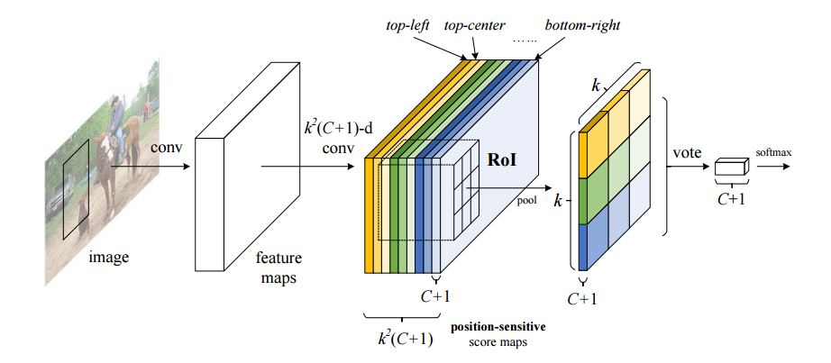

# "R-FCN:object detection via region-based fully convolutional network"

<!--使用MathJax编辑latex公式-->

## 摘要
---
我们推出了一种基于区域的、全卷积神经网络来完成准确和高效的物体识别任务。为了完成这个目标，我们推出了position-sensitive score maps来平衡分类和定位中的误差，从而我们可以直接将全卷积分类网络拿来进行物体定位识别任务。

---
## 论文的主要贡献：
---
- Thus the spatial pooling layer in image classification networks is naturally turned into the ROI pooling layer in object detection networks.

- 在R-FCN中，所有的层都是卷积层，最后一层卷积层生成\\k^2\\个位置敏感得分图，并得到\\k^2(C+1)\\个输出层

- R-FCN最终层未位置敏感ROI聚合层，该层将最后的卷积层和生成得分聚合在一起，我们的位置感敏ROI聚合层将会对最终的卷积层进行锐化。

- Backbone architecture: R-FCN是基于ResNet-101模型的，原始的ResNet-101模型包含100个卷积层与全局均值池化层，并进行一千分类任务，我们将均值池化层与全连接层去掉，仅保留卷积层，然后我们在最底层加上1024d \\(1\*1\\)的卷积层进行降维，

- Position-sensitive score maps & Position-sensitive RoI pooling.我们将整个图像划分成\\k\*k\\个区域，对于\\w\*h\\的图像，每一块区域的大小等比例下降  

- The \\k^2\\位置敏感得分图上，我们计算每一个区域的得分均值，然后用一个\\(c+1)\\维的softmax进行排名

- 我们在计算定位框的回归上也使用相似的策略 

## 相关工作
---
- Deep CNNs for object detection.
- Scalbility and speed.
- Localization methods.
- Transfer learning.
- R-CNN extensions.

## 模块设计

---
### 3.1 Module design

- 为了计算可能区域，我们首先需要利用CNN来快捷方便地生成特征。我们使用矩形框将目标区域标出并归一化成一定的长宽。
In order to compute features for a region proposal, we must first convert the image data in that region into a form that is compatibel with the CNN,
its architecture requires inputs of a fixed S * S pixel size, we warp all pixels in a tight bounding box around it to the requires size.
- 

### 3.2 Test-time detection

- 我们使用前向神经网络在2000个可能区域提取特征，针对每一个类图像，我们使用SVM根据神经网络生成的特征训练判别模型，随后我们使用非极大值抑制获得最佳结果区域候选框。
We warp each proposal and forward propagate it through the CNN in order to compute features.Then, for each class, we score each extracted feature vector using the SVM trained for that class.Given all scored regions in an images, we apply a greedy non-maximum suppression that rejects a region if it has an intersection-over-union overlap with a higher scoring selected region larger than a learned threshold.

- 使用RCNN进行定位识别任务有如下几个优势 

1. 所有类别的生成特征神经网络共享同一套参数 all CNN parameters are shared across all categories
2. 使用CNN得到的特征与其他方法获得的特征相比具有更低的维度 Second the feature vectors computed by the CNN are low-dimensional when compared to other common approaches.
3. 在当前系统中需要关心的参数是 SVM权重 以及 非极大值抑制, 其中 CNN生成的特征矩阵为 2000 * 4096 而 SVM 权重矩阵为 4096 * N，N为定位任务的类别数
  分析指出，RCNN可以识别出上千种类型(analysis shows that R-CNNs can scale to thousands of object classed without resorting to approximate thechniques.)

### 3.3 Trainning 
1. Supervised pre-training
- 我们使用ILSVRC2012分类挑战的数据进行预训练。

2. Domain-specific fine-tuning 
- 为了将CNNC应用到detection任务中，我们在预训练的神经网络上，输入目标的warped region proposals，使用随机梯度下降法来更新网络的参数。除了将ImageNet 1000分类的softmax层替换成随机初始化的（N+1）分类层，整个神经网络的结构不变。例如在VOC中N=20，而在ILSVRC2013中N=200。
- 在训练过程中，我们将于目标区域有0.5以上IoU的区域视为正样本，背景区域识为负样本。
- SGD的学习率为0.001，在每一次SGD迭代过程中，采样32个正样本和96个负样本，用来构成128个样本的mini-batch，这样安排比例是因为有效区域的面积是远小于背景区域面积的，而针对VGG网络，由于其网络参数较多，运用缓存较大，可适当减少mini-batch的个数

## 4.分析
---

## 5.ILSVRC2013 DETECTION DATASET
---

### 5.3 结果表格

## 6 SEMANTIC SEGMENTATION
- 我们针对CPMC区域使用了三种策略：
1. 第一种策略，忽略区域形状，直接根据形变后的区域计算CNN特征，但这个方法不适用于非矩形区域
2. 第二种策略，根据区域的前景掩膜计算CNN特征，我们将背景区域替换成预先计算好的均值，所以在进行了均值归一化后，背景的值为0。(background regions are zero after mean subtraction)
3. 第三种策略，结合了第一种和第二种策略。

## 7 实现细节
