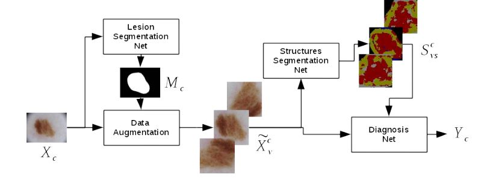
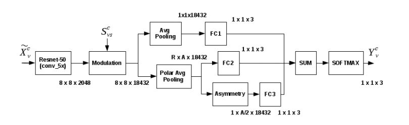
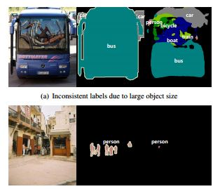
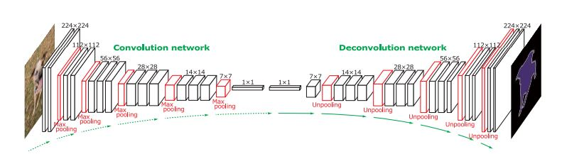

# 基于FCN的目标分割与识别

---
## 1."Incorporating the Knowledge of Dermatologists to Convolutional Neural Networks for the Diagnosis of Skin Lesions"
---

### 论文主要贡献：
---
- 本文针对伤痕识别任务分别建立了三个神经网络，最终形成了一个端到端的伤痕识别系统，其中三个网络分别是伤痕分割网络(lesion segmentation net),伤痕组织分割网络(Structures Segmentation Net),诊断网络(Diagnosis)，其中伤痕分割网络用来进行伤痕粗定位，伤痕组织分割网络用来提取伤痕分割结果，识别网络将伤痕组织分割网络的结果和原图作为输入进行伤痕种类分类
- 伤痕分割网络：该网络能够将识别输入的伤痕位置，建立伤痕的掩膜，通过掩膜定位出有效伤痕图像后，对有效伤痕图像进行数据增广，通过将有效伤痕数据进行翻转、模糊、位移等处理方法，建立伤痕的数据集
- 将经过数据增光的数据集输入到伤痕组织分割网络后，它将识别8种组织：1.点、淤青 2.有颜色的网格 3.均匀区域 4.回归区域 5.蓝白散状 6.条纹 7. 血管 8.未指明的特征
- 在诊断网络中，我们修改了网络的最终结构，我们将原来的一个全连接层修改为了三个全连接层，分别进行均值池化、归一化极性池化、估计对称性，我们将三个全连接层得到的结果进行加和，最后进行诊断判断

本文建立了三个网络进行伤痕识别

诊断网络结构

### 论文思考
- 论文使用了一种新的思路进行伤痕诊断

---
## 2."Learning Deconvolution Network for Semantic Segmentation"
---

### 论文主要贡献：
---
- 本文推出了基于反卷积和上采样的图像分割算法，旨在解决目前的基于反卷积和上采样的图像分割算法解决不了的问题，比如网络预先定义了固定尺寸的感受野，会导致网络进行过度分割或者无法分割出较小的物体，如下图所示

基于全卷积网络的分割中的一些缺陷

- 在传统的FCN中，物体的细节结构往往被模糊或者丢失，经过深层的卷积过后再反卷积出来的物体边缘往往无法被良好地描述，现在通过使用CRF来解决这个问题
- 本文主要使用以下几种手段来提升基于FCN的分割算法效果:1.我们直接训练了一个只包含反卷积、上采样和relu结构的网络

诊断网络结构

### 论文思考
